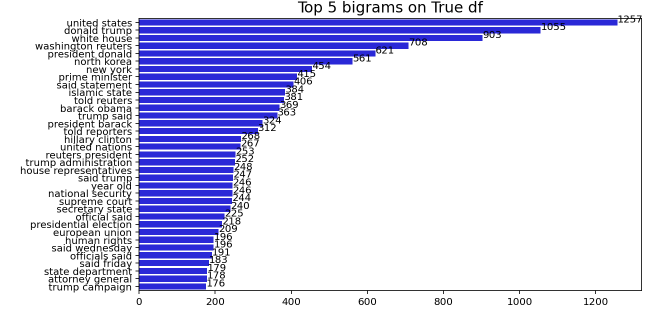
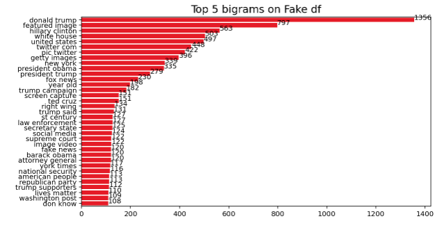
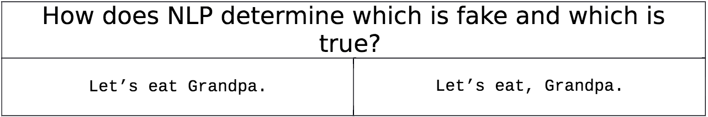
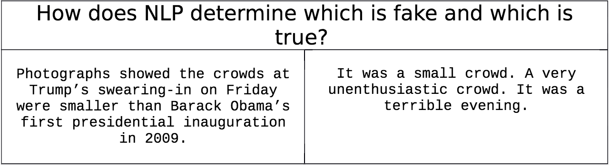

#### Final Project - Can NLP Machine Learning Predict Fake News?

### Team Members
* Anastasia Bolboceanu
* Anika Johnson
* Bernt Stenberg
* Henock Yacob


#### Project Description
Using data sets provided by Clément Bisaill via Kaggle, we developed a Fake News Detector designed to identify and analyze news articles, and their level of truthfulness. The list of articles in this dataset were procured by [Politifact](https://www.politifact.com/) and categorized according to their [“Truth-O-Meter Ratings”](https://www.politifact.com/article/2018/feb/12/principles-truth-o-meter-politifacts-methodology-i/#Truth-O-Meter%20ratings) listed below. Data was then taken from Politifact Truth-o-Meter for years 2016-2017 categorized as either "True" or "False". Our goal was to perform ETL on the data in Python and PostgreSQL, and leverage machine learning and NLP techniques to analyze/detect fake news.

#### Truth-O-Meter Ratings
  * TRUE – The statement is accurate and there’s nothing significant missing.
  * MOSTLY TRUE – The statement is accurate but needs clarification or additional information.
  * HALF TRUE – The statement is partially accurate but leaves out important details or takes things out of context.
  * MOSTLY FALSE – The statement contains an element of truth but ignores critical facts that would give a different impression.
  * FALSE – The statement is not accurate.
  * PANTS ON FIRE – The statement is not accurate and makes a ridiculous claim.

#### How does Politifact Fact-check?

"Every fact-check is different, but generally speaking our reporting process includes the following:
a review of what other fact-checkers have found previously;
a thorough Google search;
a search of online databases;
consultation with a variety of experts;
a review of publications
and a final overall review of available evidence." source

#### What is NLP?

Natural Language Processing is a machine learning method that breaks down the components of text to understand the grammer and writing style of the text.

#### How can We Replicate the Fact-checking Process with Machine Learning?

NLP cannot evaluate the truth of a text. It can however, compare stylistic elements used by reputable news sources like journalistic writing conventions and contrast that with stylistic elements used by unreliable news sources. NLP can also preform sentiment analysis. 

#### Initial Data Analysis

We created several initial bar graphs to help us understand how our data was distributed by article subject. "PoliticsNews" was the most referenced subject overall. The most referenced subject for **_fake news_** was "News" and **_true news_** was "politicsNews".

Below are the top 15 words (unigrams) referenced in our true and fake news. You can see some overlap in the top words. The top 5 overlapping words were:

_{'new', 'people', 'president', 'said', 'trump'}._


Next, we looked at the top word phrases (bigrams) used in true and fake news. Here the top overlapping words were: 

_{'barack obama',
 'donald trump',
 'hillary clinton',
 'new york',
 'secretary state',
 'supreme court',
 'trump administration',
 'trump campaign',
 'trump said',
 'united states',
 'white house',
 'year old'}_




#### ETL

To clean our data, we assigned categories to our true and false data, and join the datasets. We dropped rows with articletext under 100 words to get rid of incomplete and empty rows. Using Pyspark, we created features (StringIndexer, Tokenizer, StopWordsRemover, HashingTF, and IDF) and a VectorAssembler for our dataset, and used them to create a pyspark pipeline. Next, we ran the data through the pipeline to complete the cleaning process. 

**Pipeline Stages:**

**StringIndexer** --> **Tokenizer** --> **StopWordsRemover** --> **HashingTF** --> **IDF** --> **VectorAssembler**

#### Creating Our NLP Model

Text analysis via machine learning requires assigning a numerical value to words, a task completed by the creation of a machine learning model. How the machine learning algorithm determines the value of each word is critical to the algorithm’s ability to determine patterns of true or fake news, in our case. Valuation of words is completed via a number of standard approaches.

Our model uses the Bag of Words approach combined with Term Frequency-Inverse Document Frequency (tf-idf) to eliminate the advantage commonly used words would otherwise enjoy. In essence, all text is stripped of the most common articles and punctuation, and the resulting word frequency of the text is established. TF-IDF adds a degree of nuance to the valuation of words by looking at frequency rate of words across documents, with infrequent words given a higher value (that is, they are considered more important). 

“The limitation of the bag of words approach is that it is solely based on using wordsin the document without taking into consideration any context information.” “Since analysis of words is not enough for predicting fake news, other linguistic approachessuch as analysis of the syntax and grammar of the language have to be taken into consideration.” (Shrestha, 2018). 

Consider the following simple example:



Here is another example from actual news articles, one true and one false:



This limitation is important when it comes to detecting fake news, as evidenced by the single most predictive word for true articles in our model: “Reuters,” a word associated with the majority of true articles in our training set. Beyond such a clear classifier, there is an arms race between creators of fake news and detectors of fakenews. At the heart of the arms is how “Fake news affects human judgment and behavior.” “Because different domains differ in the content type and the choice of 
words, there are challenges associated with building a classifier that works for all kinds of domains” (Shrestha, 2018). 

Consider the following fake news: 

* Russia has declared war on the United States after Donald Trump accidentally fired a missile in the air.

* Russia said it had “identified the missile’s trajectory and will take necessary measures to ensure the security of the Russian population and the country’s strategic nuclear forces.” The WhiteHouse said it was “extremely concerned by the Russian violation” of a treaty banning intermediate-range ballistic missiles.

* The US and Russia have had an uneasy relationship since 2014, when Moscow annexed Ukraine’s Crimea region and backed separatists in eastern Ukraine.

This piece of fake news was written by an AI trained to understand language via parsing over 43 million websites. The text “was auto-generated by an algorithm fed the words “Russia has declared war on the United States after Donald Trump accidentally ...” (Knight, 2019). 

Detecting fake news therefore requires building a machine learning model that can incorporate a diverse set of parameters beyond just the text or title of an article or simply tokenizing words. Subsequent generations of fake news detectors leverage additional parameters such as linguistic analysis that can find patterns in linguistic cues, such as tone (positive or negative), directness, and use of narrative versus analytical arguments. Linguistic approaches can also begin to parse out the use of emotion in text, which is relevant to detecting fake news. 

Other approaches, such as Probability Context-Free Grammars (PCFG) transform sentences into parse-trees. PCFGs allow for greater pattern detection of sentence structures, and facilitate a deception accuracy rating of 85%. 

Semantic Analysis uses similar articles and especially reader comments to assess for truthfulness. “If most similar articles are not in line with the news, it is most likely that the news might be biased or fake. Similarly, the comments on the article can be used to evaluate whether the facts in the article are reliable” (Shrestha, 2018). This approach is similar to the n-gram approach. Drawbacks to this approachinclude finding similar articles, verifying profiles of authors, and “accounting for different words that imply the same thing.” (Shrestha, 2018). 

Some models use databases to cross reference identified factual claims or descriptions of historical events as a way of determining accuracy. 

#### Fitting Our Naive Bayes Model

We created our Naive Bayes model using Pyspark. we performed a random split on our data, with 70% training, 30% testing. Our model produced an accuracy of predicting an articles truthfullness of 0.984125.

#### Testing Our Naive Bayes Model

To test our Naive Bayes model, we gathered additional Politifact articles (25 true and 25 false), starting with the most recent articles posted on the site from April-May 2020.

#### Logistic Regression Model

We created our second model using Logistic Regression and the sentiment analyzer from the Natural Language Toolkit (NLTK) which categorizes words by positive, negative or neutral sentiment. This initial model produced an accuracy of 0.7013. We then applied a CountVectorizer to further improve our model. The second attempt produced an accuracy of 0.9893.

#### Creating our App

We created a fake news detector website to test the predictive power of our logistic regression model. On the site you can enter a news article and our model will test its accuracy.  

#### Limitations of NLP models

1) Our model could be further streamlined to filter out some words that were overweighted in our models. For example, "Reuters" which appears at the beginning of many Reuters articles that were included in the dataset is included as one of the top true news words. Other words like "said" and "Trump" which appear in both true and fake news could be removed for better accuracy. 

2) Our model was developed using data from a specific time period: (2016 to 2017)
* Naives bayes is based on two assumptions: 1) predictors are independent of each other, and 2) past conditions still hold true. When we make predictions from historical data we may get incorrect results if circumstances have changed.
*  Top fake news words may change overtime when connected to real world events that fade from popularity. 

3) Our model identifies text patterns well from humans not machines.
*  [Bayesian Poisoning:](https://en.wikipedia.org/wiki/Bayesian_poisoning) in email spam detection, spammers will try to break machine learning algorithms by attempting to produce a false positive id by introducing positive words that are less likely to indicate spam into their emails. 
* Neural Fake News: this type of fake news uses a Neural Network based model to generate news that replicates the language style used in real news. 

#### Practical Application for this type of model
* "spam filter" which can indicate when a source contains language that indicates it might not be accurate.

#### Additional Research Ideas
*  Create a webscrapping tool that will update our dataset with current news articles from Politfact that will allow us to continue to train our model and keep our model relevant. 
* Develop a new model that can fight Neural Fake News.

-----------------------------
#### Methods

### Data Management:
* Amazon Relational Database Service (RDS)
* Postgres

### Project Components:
* Scikit-Learn
* Python
* PostgreSQL
* HTML/CSS/Bootstrap
* JavaScript 
* Google Colab
* NLTK

------------------------------
#### How to Run this App:

### Prerequisites:
* Install flask
* Install PostgresSQL
* Install Python 3
* Install PySpark
* Install NLTK
* Install Scikit-Learn
* Install Numpy
* Install Matplotlib
* Install Pandas


### Step-by-Step Process to Run Naive Bayes Model:
1. Clone the repo to your desktop.
2. Open naive_bayes_model.ipynb in Google Colab. 
3. run the notebook.

### Step-by-Step Process to Run App:
1. Clone the repo to your desktop.
2. Navigate to the Web visualization folder that contains **_app.py_** and launch a GitBash or Terminal.
3. Type ```python app.py```.
5. Copy server port http://127.0.0.1:5000/ in your Chrome browser.

### Dataset:
https://www.kaggle.com/clmentbisaillon/fake-and-real-news-dataset
